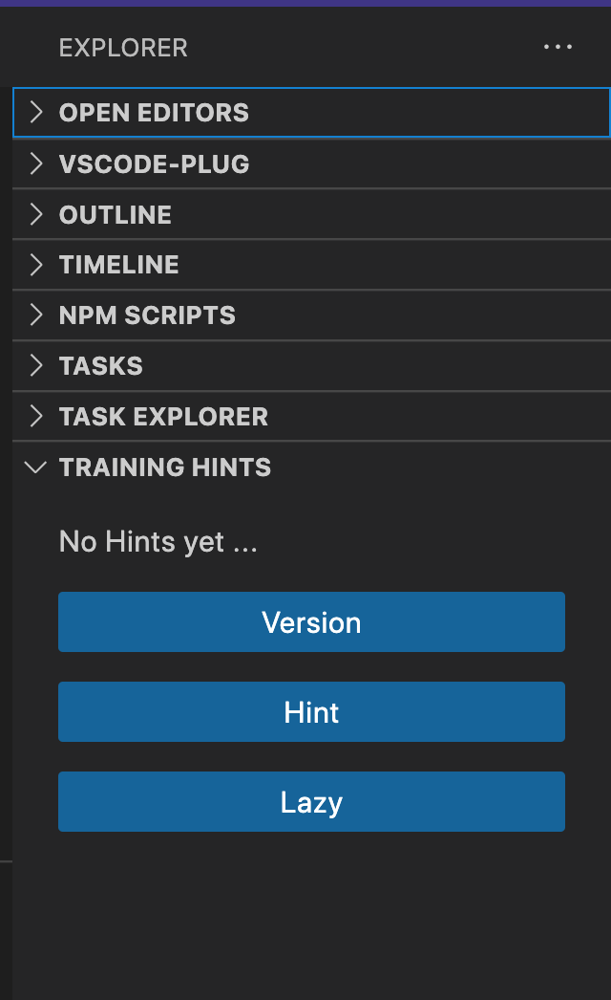

# hint README

This Plugin is used on lalyos's trainings when working in a terminal

## Install

- Install from the [VisualStudio Marketplace](https://marketplace.visualstudio.com/items?itemName=lalyos.hint)

- Manually
  - download vsix file from: [v0.0.0.1 Release](https://github.com/lalyos/vscode-plugin-hint/releases/download/v0.0.1/hint-0.0.1.vsix)
  - Install from: Extensions/.../Install from VSIX

## Features

You will have a new section in Explorer: **Training Hints**, with 2 buttons:
- hint: copy/pastes the presenter last command into terminal without executiong it
- lazy: hint + ENTER

## Release Notes

### 0.0.1

First Beta release

---
